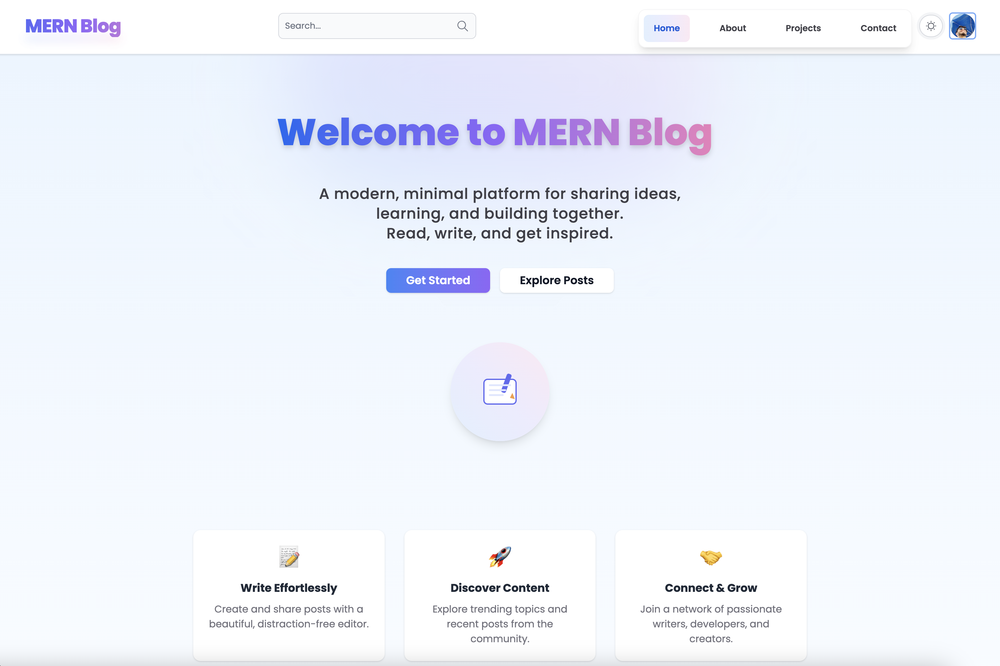
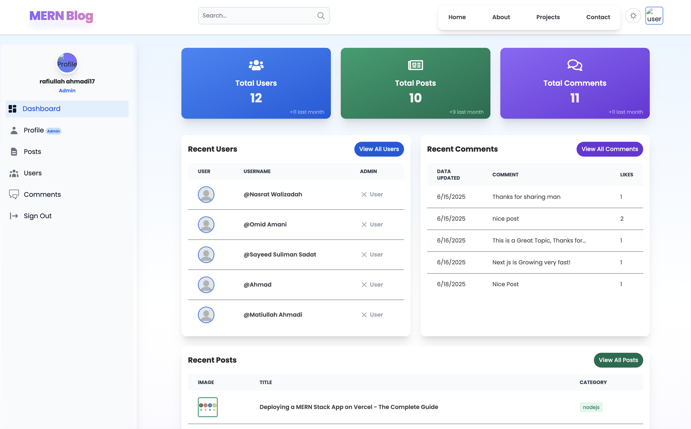
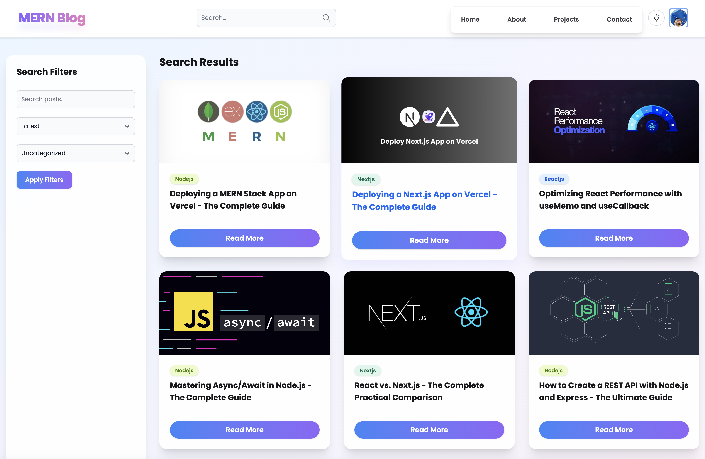
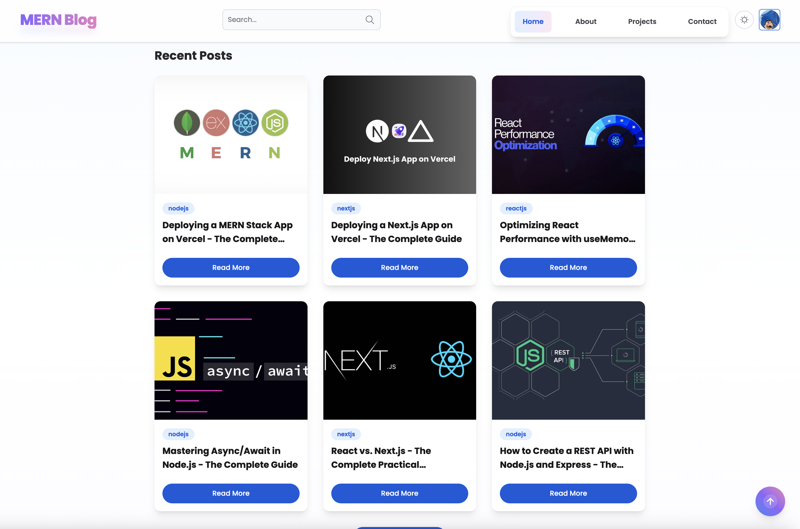
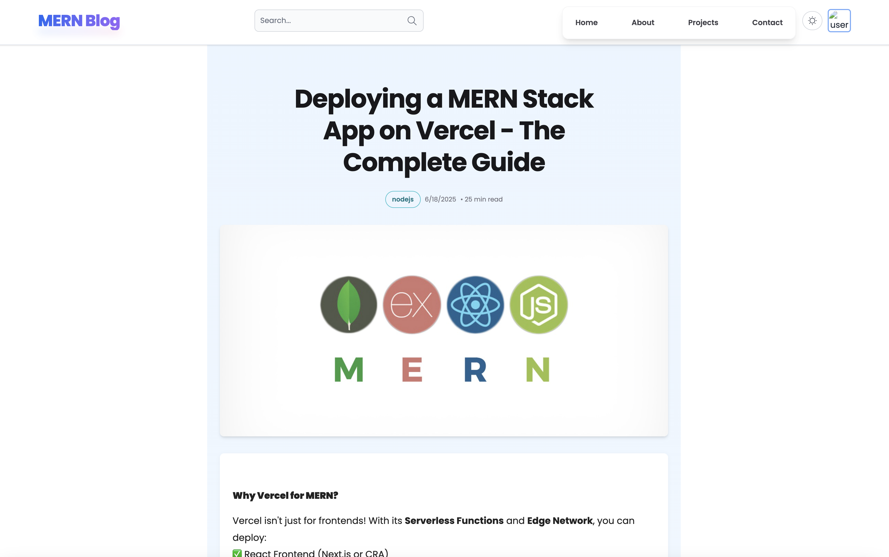
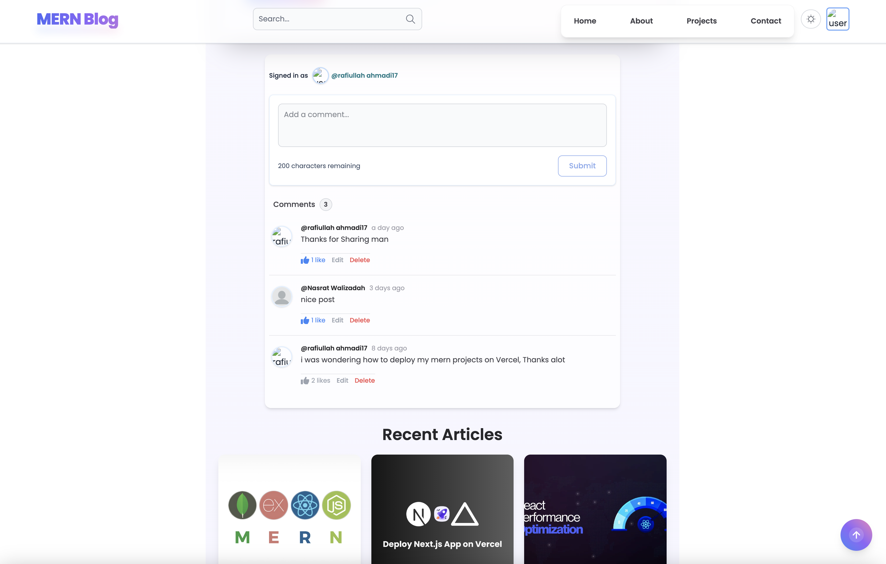

# 🚀 MERN Blog Application

A modern, full-stack blog platform built with the **MERN** stack (MongoDB, Express, React, Node.js) and **Firebase Authentication**.  
Users can register, log in (including Google login), verify email, reset password, create and manage blog posts, comment, and interact with a beautiful, responsive UI.  
**Firebase** handles all authentication (email/password, Google, email verification, password reset), while **JWT** is used for secure session management.

---

## 📑 Table of Contents

- [✨ Features](#-features)
- [🖼️ Screenshots](#-screenshots)
- [🛠️ Tech Stack](#-tech-stack)
- [⚡ Getting Started](#-getting-started)
- [📁 Project Structure](#-project-structure)
- [🔗 API Endpoints](#-api-endpoints)
- [🔒 Authentication & Authorization](#-authentication--authorization)
- [🚀 Deployment](#-deployment)
- [🤝 Contributing](#-contributing)
- [📝 License](#-license)
- [📬 Contact](#-contact)

---

## ✨ Features

- **🧑‍💻 User Authentication:** Handled by Firebase (email/password, Google, email verification, password reset)
- **🔐 Session Management:** JWT for secure session management
- **🛡️ User Roles:** Admin and regular users, with role-based access control
- **👤 Profile Management:** Update profile, upload avatar, change password, delete account
- **📝 Blog Posts:** Create, edit, delete, and view posts with images and categories
- **💬 Comments:** Add, view, and delete comments on posts
- **📊 Admin Dashboard:** Manage users, posts, and comments with advanced controls
- **📱 Responsive UI:** Fully responsive design using TailwindCSS and Flowbite
- **🎨 Animations:** Smooth, professional UI animations with Framer Motion
- **🔍 Search:** Search posts by title or content
- **⏩ Pagination:** Efficient pagination for posts, comments, and users
- **⚠️ Error Handling:** User-friendly error messages and notifications
- **🔒 Security:** JWT, HTTP-only cookies, input validation, and secure API routes

---

## 🖼️ Screenshots

Here are some screenshots of the MERN Blog Application:

<p align="center">
  
</p>
<p align="center">
  
</p>
<p align="center">
  
</p>
<p align="center">
  
</p>
<p align="center">
  
</p>
<p align="center">
  
</p>

<!-- Add more screenshots as needed. Place your images in a 'screenshots' folder in your repo root or update the paths accordingly. -->

---

## 🛠️ Tech Stack

### Frontend

-  **React** (with Vite)
-  **Redux Toolkit**
-  **React Router**
-  **TailwindCSS** & **Flowbite**
-  **Framer Motion**
-  **Axios**
-  **React Toastify**
-  **Firebase Authentication**

### Backend

-  **Node.js** & **Express.js**
-  **MongoDB** (with Mongoose)
-  **JWT** (session management)
-  **Multer**
-  **Cloudinary** or local storage
-  **Helmet**

---

## ⚡ Getting Started

### 📦 Prerequisites

- Node.js (v18+ recommended)
- npm or yarn
- MongoDB (local or Atlas)
- Firebase project (for authentication)

### ⬇️ Installation

1. **Clone the repository:**

   ```bash
   git clone https://github.com/your-repo/mern-blog.git
   cd mern-blog
   ```

2. **Install dependencies for both client and server:**
   ```bash
   cd Client
   npm install
   cd ../Server
   npm install
   ```

### 🔑 Environment Variables

Create a `.env` file in the `Server` directory with the following:

```env
PORT=5000
MONGO_URI=your_mongodb_connection_string
JWT_SECRET=your_jwt_secret
CLOUDINARY_CLOUD_NAME=your_cloudinary_name
CLOUDINARY_API_KEY=your_cloudinary_key
CLOUDINARY_API_SECRET=your_cloudinary_secret
FIREBASE_API_KEY=your_firebase_api_key
FIREBASE_AUTH_DOMAIN=your_firebase_auth_domain
FIREBASE_PROJECT_ID=your_firebase_project_id
FIREBASE_APP_ID=your_firebase_app_id
```

> _If you use local storage for images, adjust accordingly._

### ▶️ Running the App

**Start the backend:**

```bash
cd Server
npm run dev
```

**Start the frontend:**

```bash
cd ../Client
npm run dev
```

The app will be available at [http://localhost:5173](http://localhost:5173) (or your Vite port).

---

## 📁 Project Structure

```
MERN Blog/
├── Client/                  # Frontend (React)
│   ├── public/
│   └── src/
│       ├── assets/
│       ├── components/
│       ├── firebase/        # Firebase config & hooks
│       ├── pages/
│       ├── redux/
│       ├── App.jsx
│       ├── main.jsx
│       └── ...
│   ├── .env                 # Frontend environment variables
│   └── package.json
├── Server/                  # Backend (Node/Express)
│   ├── Controllers/
│   │   ├── commentController.js
│   │   ├── postController.js
│   │   └── userController.js
│   ├── Middleware/
│   ├── Models/
│   │   ├── Comment.js
│   │   ├── Post.js
│   │   └── User.js
│   ├── Routes/
│   │   ├── authRoutes.js
│   │   ├── commentRoutes.js
│   │   ├── postRoutes.js
│   │   └── userRoutes.js
│   ├── config/              # Backend config (e.g., firebase-service-account.json)
│   ├── .env                 # Backend environment variables
│   ├── index.js             # Backend entry point
│   └── package.json
├── README.md
└──

---

## 🔗 API Endpoints

### Auth

- `POST /api/v1/auth/register` — Register new user (via Firebase)
- `POST /api/v1/auth/login` — Login user (via Firebase)
- `POST /api/v1/auth/google` — Google login (via Firebase)
- `POST /api/v1/auth/verifyEmail` — Email verification (via Firebase)
- `POST /api/v1/auth/forgotPassword` — Forgot/reset password (via Firebase)
- `POST /api/v1/auth/logout` — Logout user
- `GET /api/v1/auth/getUsers` — Get users (admin only)
- `DELETE /api/v1/auth/delete/:id` — Delete user (admin/self)

### Users

- `GET /api/v1/users/:id` — Get user profile
- `PUT /api/v1/users/:id` — Update user profile

### Posts

- `GET /api/v1/posts/getPosts` — Get posts (with pagination, search, filter)
- `POST /api/v1/posts/createPost` — Create post
- `PUT /api/v1/posts/updatePost/:id` — Update post
- `DELETE /api/v1/posts/deletePost/:id/:userId` — Delete post

### Comments

- `GET /api/v1/comment/getcomments` — Get comments (with pagination)
- `POST /api/v1/comment/createComment` — Add comment
- `DELETE /api/v1/comment/deleteComment/:id` — Delete comment

### Upload

- `POST /api/v1/upload` — Upload image (profile/post)

---

## 🔒 Authentication & Authorization

- **Firebase Authentication** for email/password, Google login, email verification, and password reset.
- **JWT** for secure session management.
- Protected routes for posts, comments, and admin dashboard.
- Role-based access for admin features.

---

## 🚀 Deployment

You can deploy the app using services like **Vercel**, **Netlify** (frontend), and **Render**, **Heroku**, or **Railway** (backend).
Set environment variables in your deployment dashboard.

---

## 🤝 Contributing

1. Fork the repository
2. Create your feature branch (`git checkout -b feature/YourFeature`)
3. Commit your changes (`git commit -m 'Add some feature'`)
4. Push to the branch (`git push origin feature/YourFeature`)
5. Open a Pull Request

---

## 📝 License

This project is licensed under the MIT License.

---

## 📬 Contact

- **Author:** Rafiullah Ahmadi
- **Email:** your.email@example.com
- **GitHub:** [your-github-username](https://github.com/your-github-username)

---

> _Feel free to open issues or submit pull requests!_
```
